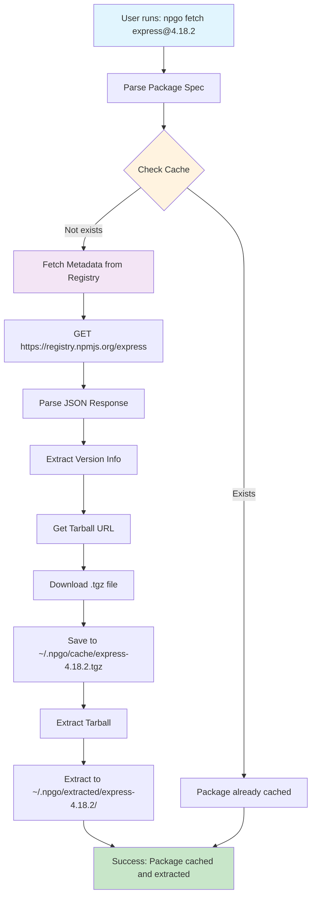

# npgo Fetch Flow Diagram

## Mermaid Diagram



## Detailed Flow Steps

### 1. Input Parsing
```
Input: "express@4.18.2"
Output: {name: "express", version: "4.18.2"}
```

### 2. Cache Check
```
Check: ~/.npgo/cache/express-4.18.2.tgz
Result: exists/not exists
```

### 3. Registry Interaction
```
URL: https://registry.npmjs.org/express
Method: GET
Response: JSON with package metadata
```

### 4. Metadata Processing
```json
{
  "name": "express",
  "version": "4.18.2",
  "dist": {
    "tarball": "https://registry.npmjs.org/express/-/express-4.18.2.tgz"
  }
}
```

### 5. Download Process
```
Source: https://registry.npmjs.org/express/-/express-4.18.2.tgz
Destination: ~/.npgo/cache/express-4.18.2.tgz
Method: HTTP GET + io.Copy
```

### 6. Extraction Process
```
Source: ~/.npgo/cache/express-4.18.2.tgz
Destination: ~/.npgo/extracted/express-4.18.2/
Process: gzip + tar extraction
```

## Error Handling

### Network Errors
- Registry unavailable
- Download timeout
- Invalid response

### File System Errors
- Cache directory creation failed
- Disk space insufficient
- Permission denied

### Package Errors
- Package not found
- Version not found
- Invalid tarball format

## Performance Considerations

### Caching Strategy
- Check cache before network request
- Avoid re-downloading existing packages
- Use file timestamps for cache validation

### Network Optimization
- Single HTTP request for metadata
- Direct tarball download
- No unnecessary redirects

### File Operations
- Stream download (io.Copy)
- Parallel extraction (future)
- Atomic file operations
