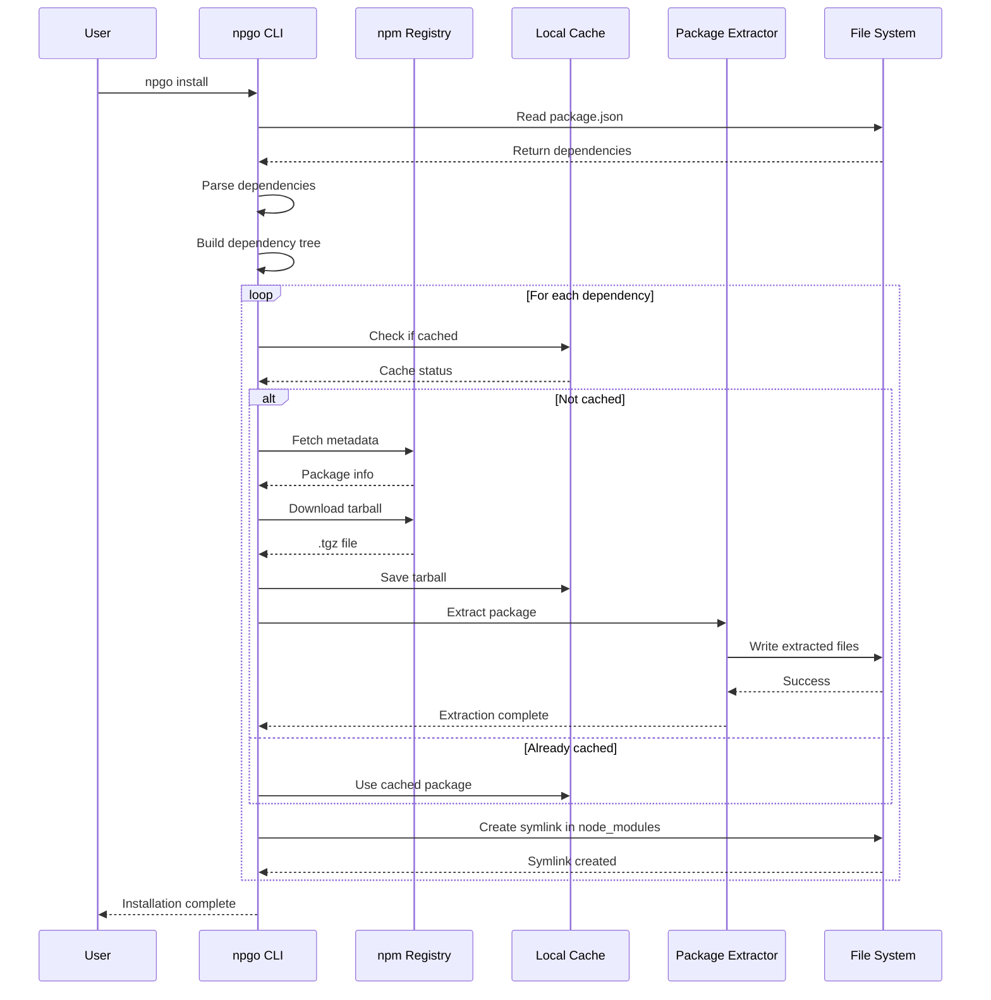
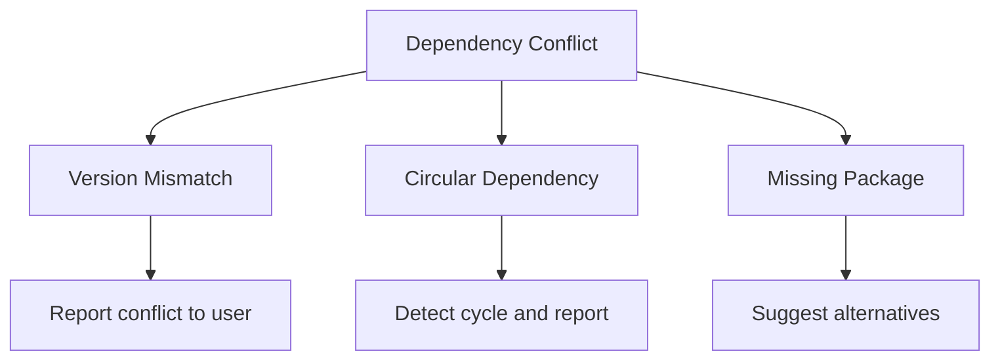
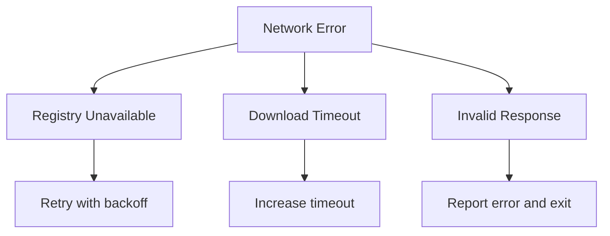

# npgo Install Sequence Diagram

## Mermaid Sequence Diagram



## Future Install Flow (Detailed)

### Phase 1: Dependency Resolution
```
1. Read package.json
2. Parse dependencies and devDependencies
3. Resolve version ranges (^, ~, >=, etc.)
4. Build dependency tree
5. Detect conflicts
```

### Phase 2: Package Fetching
```
For each package in dependency tree:
  1. Check cache existence
  2. If not cached:
     - Fetch metadata from registry
     - Download tarball
     - Extract to cache
  3. If cached:
     - Skip download
     - Use existing extraction
```

### Phase 3: node_modules Linking
```
1. Create node_modules directory
2. For each package:
   - Create symlink: node_modules/package -> ~/.npgo/extracted/package-version
   - Handle nested dependencies
3. Create .bin symlinks for executables
```

## Error Scenarios

### Dependency Resolution Errors


### Network Errors


## Performance Optimizations

### Parallel Downloads
```
- Use goroutines for concurrent downloads
- Limit concurrent connections (e.g., 10)
- Implement download queue
```

### Smart Caching
```
- Cache validation with checksums
- TTL-based cache invalidation
- Incremental updates
```

### Dependency Tree Optimization
```
- Flatten dependency tree where possible
- Deduplicate common dependencies
- Optimize symlink creation
```

## Lock File Strategy (Future)

### npgo.lock Structure
```json
{
  "lockfileVersion": 1,
  "packages": {
    "express": {
      "version": "4.18.2",
      "resolved": "https://registry.npmjs.org/express/-/express-4.18.2.tgz",
      "integrity": "sha512-...",
      "dependencies": {
        "accepts": "~1.3.8",
        "array-flatten": "1.1.1"
      }
    }
  }
}
```

### Lock File Benefits
- Reproducible builds
- Faster installs
- Dependency integrity
- Version pinning
